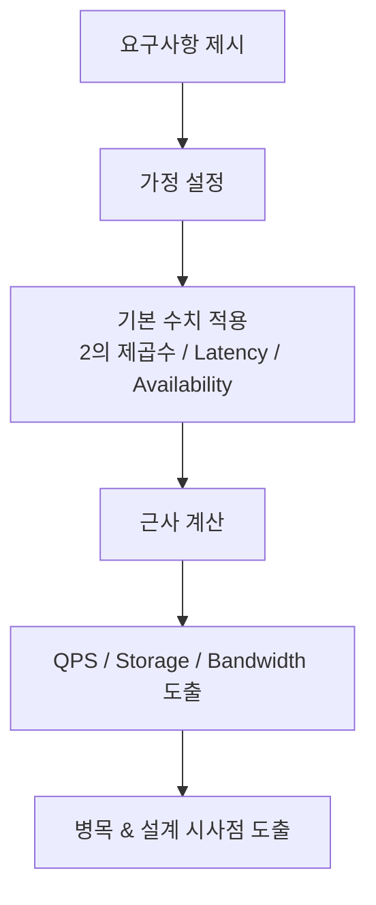
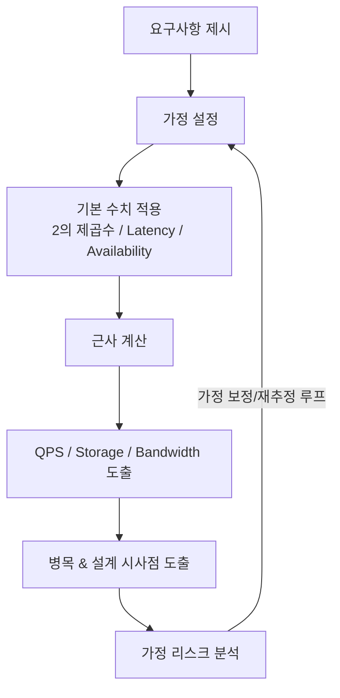
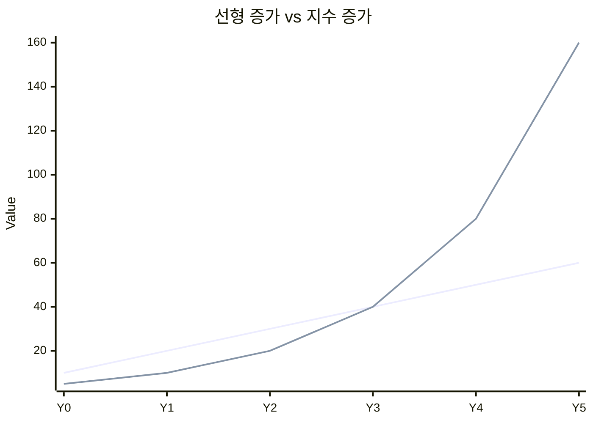
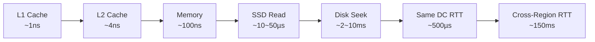
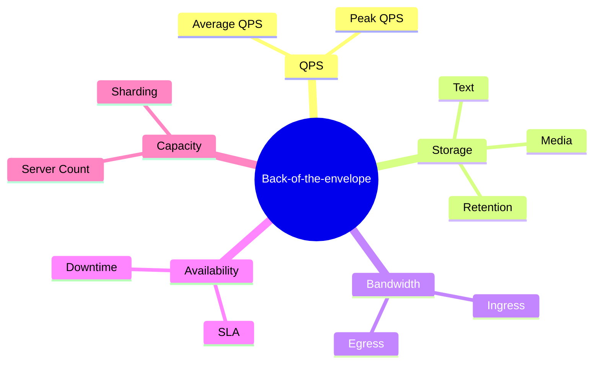

##  개략적인 규모 추정 (Back-of-the-Envelope Estimation)

---

### 1. 이 글의 정체성 (Why this chapter exists)

> **이 글은 “계산 장”이 아니다.  
> 이 글은 ‘사고 실험(thought experiment)’ 훈련 장이다.**

Jeff Dean의 정의에 따르면, 개략적 규모 추정이란:

- **보편적으로 통용되는 성능 수치**를 바탕으로
- **빠른 사고 실험**을 통해
- **현재 설계가 요구사항을 만족하는지**를 판단하는 행위

### 중요한 포인트

- 정확한 숫자 ❌
- **문제를 구조화하는 방식 ✅**
- **가정 → 근사 → 결론으로 이어지는 사고 흐름 ✅**

### 근거

내가 생각하기에 위 선언은 글을 쓰는 현재 2025년 기준에서도 **전혀 낡지 않았고**, 오히려 더 중요해졌다.

- LLM이 숫자 계산을 다 해주는 시대
- 클라우드 벤더가 용량 산정 툴을 제공하는 시대

계산이 필요한가?

**인간의 역할은 계산이 아니라 구조화이다.**

늘 그렇듯 키는 문제를 구조화하는 방식이다.

개략적 규모 추정은  설계 논리를 숫자로 반증(falsify)하는 방법이다.

---

### 2. 전체 사고 프레임

중요한건 사고의 흐름 이다.

```text
요구사항 → 가정 → 기본 수치 → 근사 → 산출 → 병목
```



누구나 여기까지는 도출을 한다.

구조화된 이흐름에 대해서 수정을하고 반복을하고 하는 과정을 인식없이 진행한다.

하지만 진짜 키는 어딜 생각해야하는지 알고 어떤것부터 집중적으로 볼것이냐 이다.

>[!Note]
>수리논리학 에서는 폭발의 원칙이라는것이 존재한다.
>논리로 인해서 모순이 생기면 (참과 거짓이 동시에 참인경우) 모든것이 참이되버린다.


>[!important]
>즉 우리는 한가지를 명확하게 알아야 한다.
>이 추정이 틀렸을 때 가장 위험한 가정은 무엇인가?
>




잘못된 가정이 존재하는지, 리스크 분석이 필요하다.

특히나 ai를 활용한 프로세스 내에서 할루시네이션이 존재하는이상

폭발의 원칙은 어느곳에서 적용될수 있고, 잘못된 가정은 사고흐름 전체에 영향을 끼친다.

- 요즘 시스템은 대부분 **확률적·불완전**
- 병목보다 더 위험한 건 **잘못된 가정**

---

### 3. 핵심 개념

---

#### 3.1 2의 제곱수 (Data Volume Thinking)

#### 핵심 메시지

> **“대규모 시스템의 데이터는 커 보이지만, 계산은 단순하다.”**

#### 기본 단위

- 1 Byte = 8 bits
- ASCII 문자 1개 ≈ 1 Byte

#### 자주 쓰이는 2의 제곱 근사

|지수|크기|명칭|약어|
|---|---|---|---|
|2¹⁰|~10³|Kilobyte|KB|
|2²⁰|~10⁶|Megabyte|MB|
|2³⁰|~10⁹|Gigabyte|GB|
|2⁴⁰|~10¹²|Terabyte|TB|
|2⁵⁰|~10¹⁵|Petabyte|PB|

#### 이 안에서 고민해야 할 것

- ❓ _“이 데이터는 텍스트인가? 미디어인가?”_
- ❓ _“총량을 지배하는 필드는 무엇인가?”_
- ❓ _“증가율이 선형인가, 지수적인가?”_




여기에 한가지가 추가되면 좋다.

❓ 이 데이터는 **Hot인가 Cold인가**?

- 저장 비용보다 **접근 패턴**이 비용을 좌우함 
- Glacier / Deep Archive / Tiered Storage가 기본 전제
	- **Tiered Storage**: 핫은 비싸고 빠른 곳, 콜드는 싸고 느린 곳으로 계층을 나눠 저장하는 전략
	- Glacier/Deep Archive: **콜드 전용**(싸지만 복구 느림 + 꺼낼 때 돈/시간 듦)

❓ 추가적인 고려사항

- 이 데이터는 자주 읽히는가?
- 이 데이터는 다시 계산이 가능한가?
- 규제 대문에 반드시 보관해야 하는 데이터인가?
 
>[!important]
>저장 비용보다 접근 패턴이 비용을 좌우함 / Glacier·Deep Archive·Tiered Storage가 기본 전제는 **요즘은 데이터가 커지면 어디에 저장할지보다 얼마나 자주 꺼낼지가 아키텍처를 강제한다**

---

#### 3.2 응답지연 (Latency) 감각

> **“Latency는 계층을 건너뛸 때 폭발한다.”**

#### 계층별 시간 스케일



#### 반드시 기억해야 할 결론

- 메모리는 빠르다
- 디스크는 **여전히** 느리다
- **Disk seek (랜덤 I/O)는 피하라**
- 단순 압축은 빠르다 → 전송 전에 압축 고려
- 리전 간 통신은 설계의 “비용 폭탄”

#### 고민 포인트

- ❓ _“이 설계는 어느 계층까지 내려가나?”_
- ❓ _“Hot path에 디스크 seek이 들어가 있지 않은가?”_
- ❓ _“네트워크 RTT를 몇 번 왕복하는가?”_

와 근데 이제 이것도하나?
네트워크 홉단위별로 시리얼라이즈 디시리얼라이즈 비용산정을 하는지 모르겠는데 이건 인프라팀이 있으면 애매하다.

---

#### 3.3 가용성 (Availability) & SLA

> **“99.9%는 절대 ‘안 죽는다’는 뜻이 아니다.”**

#### 가용성의 실체 = 허용 장애 시간

|가용률|연간 장애 시간|
|---|---|
|99%|약 **3.65일**|
|99.9%|약 **8.77시간**|
|99.99%|약 **52분**|
|99.999%|약 **5.26분**|
|99.9999%|약 **31초**|

#### 핵심 메시지

- **SLA 는 책임의 경계**

>SLA 는 기술적으로 잘 만들겠다는 약속이 아니라,  SLA는 돈과 책임이 걸린 계약이다.
>SLA에 명시된 가용성 수치는 이 시스템이 얼마나 안정적인가를 말하는 것이 아니라, 어디까지 장애를 허용하며, 그 대가로 무엇을 보상할 것인가를 정의한다.

예시
- 99.99% → **멀티 AZ / 자동 장애조치 / 운영 비용 증가**
- 99.9% → **단일 AZ + 빠른 복구**로도 충분할 수 있음
 SLA는 아키텍처 선택을 강제하는 비즈니스 요구사항

- 가용성은 **아키텍처 비용과 직결**

#### 고민 포인트

- ❓ _“이 서비스는 몇 개의 9가 필요한가?”_

몇 분의 장애가 뉴스가 되는가?
- 몇 시간의 장애가 계약 위반이 되는가?
- 며칠의 장애가 회사의 신뢰를 무너뜨리는가?

이 질문에 대한 답이
99.9%, 99.99%, 99.999%라는 숫자로 표현됨

- ❓ _“장애를 숨길 것인가, 빨리 복구할 것인가?”_

>숨긴다는 건 장애를 없애는 것’이 아니라, 사용자에게 보이지 않게 흡수한다’는 뜻이다.

- ❓ _“CAP 중 무엇을 희생하는가?”_


---

### 4. 개략적 규모 추정의 표준 문제 유형



---

### 5. 트위터 예제를 통해 도출하는 사고 패턴

>트위터 예제는 숫자를 계산하기 위한 예제가 아니라 사고 패턴을 드러내기 위한 샘플이다.

#### 5.1 QPS 추정 공식 (패턴)

```text
QPS =
(DAU × 사용자 행동 수 / day)
÷ (24 × 3600)
```

- Peak QPS ≈ 2 × Average QPS (단순 가정)

**중요한 건 ‘왜 2배로 잡았는지 설명할 수 있느냐’**

---

### 5.2 저장소 추정의 본질

> **“미디어가 모든 것을 집어삼킨다.”**

- 텍스트 ≪ 메타데이터 ≪ **미디어**
- 장기 보관(retention)이 총량을 결정

#### 사고 흐름

1. 객체 1개의 평균 크기 정의
2. 하루 생성량 계산
3. 보관 기간 곱하기
4. 지배 항(dominant term) 확인

---

### 6. 사고 실험시 지켜야할 룰.

### ✅ 반드시 할 것

- 가정은 **말로 먼저 선언**
- 모든 숫자에 **단위 붙이기**
- 근사치 적극 사용
- 계산 후 **설계 시사점으로 연결**

### ❌ 절대 하지 말 것

- 소수점 정밀 계산
- 가정 숨기기
- 숫자만 말하고 끝내기

---

### 7. 실 상황에서 도입해볼만 한 것 

- ✔ “이 시스템의 병목은 디스크 seek입니다”
- ✔ “이 QPS면 캐시 없이는 불가능합니다”
- ✔ “99.99% SLA면 멀티 AZ가 필요합니다”
- ✔ “스토리지는 미디어 때문에 5년 후 PB 단위입니다”

---

### 8. 마지막 한 줄 요약

> **개략적 규모 추정은 계산 문제가 아니라  
> ‘불확실한 세계를 숫자로 설명하는 언어 능력’이다.**
