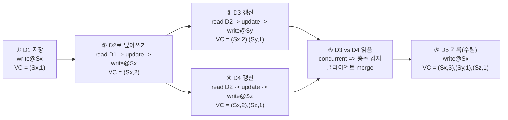

키-값 저장소 설계의 본질은 **대규모 저장 + 고가용성 + 낮은 지연**을 달성하면서,  
그 과정에서 불가피한 **일관성(consistency) ↔ 가용성(availability)** 트레이드오프를 **조절 가능한 형태로 설계**하는 것.

- **CAP 관점에서 목표 선택**
	- 실세계 분산 시스템은 파티션(P)을 피할 수 없으므로, C와 A 중 무엇을 더 우선할지 정한다.

가용성 대신 일관성을 선택한다면 데이터 불일치 문제를 피하기 위해 연산중단을 고려, 일관성 대신 가용성을 선택한다면 낡은 데이터를 반환하는 위험을 감수하더라도 읽기연산을 허용해야 한다, 파티션 문제가 해결된 이후에 새 데이터를 문제가 생긴 노드에 전송한다.

- **데이터 파티션(분산) = Consistent Hashing**
	- 노드 추가/삭제 시 데이터 이동을 최소화하고 부하를 균등 분산한다.
	
- **데이터 다중화(복제)**
	- N개의 노드에 비동기 복제하여 가용성/내구성을 높이고, 멀티 데이터센터로 장애 도메인을 분리한다.

- **정족수 합의(N/W/R)로 일관성 레버 제공**
	- 강한 일관성부터 느슨한 일관성까지 튜닝 가능하게 만든다.

>[!Note]
>정족수(**定 (정할 정)**: 결정하다, 정하다 / **足 (발 족/족할 족)**: 발, 족하다 / **數 (수 수)**: 숫자, 수) - quorum
>회의/의사결정을 유효하게 성립시키기 위한 최소 인원수
>- **N**: 복제본(사본) 총 개수
>- **W(Write quorum)**: 쓰기 요청이 “성공”으로 인정되려면 **최소 W개 노드가 쓰기 성공 응답**을 줘야 함
>- **R(Read quorum)**: 읽기 요청이 “성공”으로 인정되려면 **최소 R개 노드가 읽기 응답**을 줘야 함
>복제본이 3개(n1, n2, n3)라면:

- **W=1**: 3개 중 **1개만** “썼다” 응답하면 쓰기 성공 처리
    - 장점: 빠르고 가용성 높음
    - 단점: 다른 노드에 아직 전파 안 됐을 수 있어 **읽을 때 최신 보장 약함**
- **W=2**: **2개**가 써줘야 성공
    - 더 안전(최신 확률↑), 대신 느려지고 장애에 약해짐
- **W=3**: **3개 전부** 써야 성공    
    - 가장 강한 일관성 쪽, 대신 제일 느리고 한 노드만 문제 있어도 쓰기 실패

읽기도 동일하게 **R=1/2/3**으로 몇 개에서 읽어오면 성공인지를 정함

- **최종 일관성(EC) + 충돌 해소**: Dynamo/Cassandra 스타일로 eventual consistency를 택하면, 충돌은 **버저닝 + 벡터시계**로 감지하고 최종 해소는 보통 **클라이언트 리컨실리에이션**이 맡는다. 

백터시계

- **장애는 일상*
	- 감지: gossip/heartbeat 멤버십
	  - 일시 장애: sloppy quorum + hinted handoff 
	  - 영구 장애: anti-entropy + Merkle tree 
- **저장 엔진 경로(LSM-tree 계열)**
	- 쓰기는 commit log→memtable→SSTable, 읽기는 memtable→Bloom filter→SSTable 흐름으로 설계한다. 

---

**요구사항 → 트레이드오프 → 구현기술 조립** 흐름으로 사고 시 주요 주제는 다음 4개로 묶인다.

1. **분산(Scale-out)**
   - 파티션: consistent hashing, virtual node, heterogeneity
   - 라우팅: 해시 링 기반 노드 선택, coordinator
2. **가용성(Availability)**
   - 복제: N replicas, 멀티 데이터센터 복제
   - 장애 처리: sloppy quorum, hinted handoff, failover 전략
3. **일관성(Consistency)**
   - N/W/R로 레벨 조절
   - 강/약/최종 일관성 모델
   - 충돌 감지/해소(버저닝/벡터시계/리컨실리에이션)
4. **운영/성능(Performance & Operability)**
   - gossip 기반 membership
   - anti-entropy + Merkle tree로 동기화 비용 최소화
   - LSM 기반 read/write path로 낮은 지연 및 높은 처리량

---

대규모 데이터, 고가용성, 자동 확장, 일관성 조절 가능, 낮은 지연

### 이 요구사항들은 서로 충돌한다

- **강한 일관성**을 극단으로 밀면 → 파티션/장애 시 **가용성이 떨어지고**, 지연이 커진다.
- **가용성/지연**을 극단으로 밀면 → 복제본 간 **불일치가 필연**이고, 충돌 해소가 필요해진다.

### CAP 선택이 나머지 설계를 규정한다

- 파티션(P)은 현실에서 불가피하므로 CA는 사실상 불가능. 결국 **CP 또는 AP** 중 선택한다.
- Dynamo/Cassandra 스타일로 **AP/최종 일관성(eventual)** 에 가까운 선택을 하고, 대신 충돌 해소 메커니즘을 갖춘다.

### 조절 가능한 일관성이 안전장치

N/W/R을 조합해 특정 워크로드에서 일관성과 지연을 타협한다.

- **W+R > N**이면 읽기와 쓰기의 교집합이 생겨 “강한 일관성에 가까워질 수 있음”
- W=1, R=1 같은 구성이 빠르지만, 최신값을 못 볼 가능성(약한/최종 일관성)을 감수

### 결국 충돌은 발생한다 → 충돌을 관리 한다

최종 일관성은  언젠가 동기화 일 뿐 항상 최신 보장이 아니다.  
따라서 **버저닝 + 벡터시계**로 충돌을 탐지하고, 최종 선택(merge)은 보통 애플리케이션(클라이언트)이 수행한다.]

### 장애는 계층적으로 처리한다

- 감지(가십) → 일시 장애(힌트로 임시 위탁) → 영구 장애(anti-entropy로 수렴) 순으로 계층화한다. 

---

## 용어 정리

### CAP & 시스템 분류
- **Consistency**: 어떤 노드에 붙어도 같은 데이터를 본다(정의 수준)  
- **Availability**: 일부 노드 장애에도 항상 응답을 받는다  
- **Partition tolerance**: 네트워크 분할이 나도 시스템이 동작  
- **CP/AP/CA**: P가 현실에서 필수라 CP 또는 AP 중 선택

### Consistent Hashing (파티션)
- 해시 링에 노드 배치 → 키를 해시 링에 매핑 → 시계방향 첫 노드가 소유
- **virtual node**로 노드 성능 차이를 흡수(heterogeneity), 분포 균등화 
- 노드 추가/삭제 시 **이동 데이터 최소화**, 핫스팟 감소

### 복제(Replication)
- 복제 계수 **N**: 키 위치에서 링을 따라 N개의 노드에 사본 저장 
- **물리 서버 중복 선택 방지**(virtual node 사용 시 중요)
- **멀티 데이터센터 복제**로 장애 도메인 분리 
### 정족수 합의(N/W/R)
- **W**: 쓰기 성공으로 간주할 최소 응답 수  
- **R**: 읽기 성공으로 간주할 최소 응답 수  
- W, R, N은 **지연 ↔ 일관성** 타협점 
- 중재자(coordinator)가 프록시처럼 요청을 받아 분산/복제본에 요청 

### 일관성 모델
- **Strong**: 항상 최신 읽기(대신 가용성/지연 희생)  
- **Weak**: 최신이 아닐 수 있음  
- **Eventual**: 언젠가 수렴(대규모 분산에서 흔한 선택) 

### 불일치 해소: 버저닝 + 벡터시계
- 각 쓰기마다 새 버전(immutable 버전들)
- 벡터시계: (서버ID, 버전카운터)들의 집합으로 “선후관계/동시성” 판별
- 충돌 해소는 보통 **클라이언트 리컨실리에이션**이 담당 
- 벡터시계 항목이 폭증할 수 있어 임계치로 오래된 항목을 제거(정확도↔비용 타협)

### 장애 처리 패턴
- **감지**: gossip + membership list(heartbeat counter) 
- **일시 장애**: sloppy quorum + hinted handoff(복구 후 힌트 반영) 
- **영구 장애**: anti-entropy + Merkle tree(차이만 동기화)

### 저장 엔진(Read/Write Path)
- 쓰기: **commit log → memtable(mem cache) → SSTable** 
- 읽기: memtable → **Bloom filter** → SSTable

---

### 6.1 반드시 해볼 연습 문제 (손으로 풀어보면 체화되는 것들)
1. **N/W/R 튜닝 문제**
   - N=3일 때 (W,R) 조합별로
     - “가장 빠른 쓰기/읽기”
     - “가장 강한 일관성에 가까운 설정”
     - “장애 1대/2대에서의 가용성”을 표로 정리해보기
2. **벡터시계 충돌 판별**
   - 3개 노드에서 동시에 업데이트가 발생했을 때
     - (A,1)(B,0)(C,0) vs (A,0)(B,1)(C,0) 같은 형태에서
     - “선후관계 / 동시성”을 판정하고
     - 어떤 병합 정책이 가능한지(Last-write-wins vs 도메인 병합) 고민
3. **sloppy quorum 시나리오**
   - 링에서 원래 담당 노드가 다운일 때
   - 임시로 어떤 노드가 쓰기를 받고, 복구 시 어떤 데이터를 어떻게 돌려주는지(힌트 저장 위치 포함) 시퀀스 작성
4. **Merkle tree 동기화 비용**
   - 키 공간을 버킷으로 나눌 때 버킷 수가 동기화 비용/메모리에 주는 영향(너무 크면 트리 비용, 너무 작으면 차이 탐지 과대) 정리

### 6.2 “아는 척”이 아니라 “설계로 설명”하는 면접 포인트
- “CAP은 외워서 말하는 게 아니라, **파티션이 났을 때 무엇을 포기할지**를 답하는 도구”
- “정족수 N/W/R은 **SLA(지연)와 일관성 요구**를 숫자로 표현하는 레버”
- “eventual consistency는 ‘대충’이 아니라, **충돌 관리 메커니즘(버저닝/벡터시계/리컨실)에 대한 약속**”
- “장애 처리는 단일 기법이 아니라, **감지→완화→수렴**의 계층적 설계”

---

## 부록 A) ‘장 전체를 한 눈에’ 매핑(내가 만든 요약표)

| 목표/문제 | 설계 선택(기술) | 이유(한 줄) |
|---|---|---|
| 대규모 저장, 균등 분산 | consistent hashing (+ virtual nodes) | 노드 변화 시 재배치 최소화, 핫스팟 완화 |
| 고가용성/내구성 | N replicas, 멀티 DC 복제 | 단일 노드/센터 장애에서도 서비스 지속 |
| 일관성 조절 | quorum N/W/R | 지연-일관성 tradeoff를 숫자로 제어 |
| eventual consistency의 충돌 | versioning + vector clock | 동시 업데이트 충돌을 감지/표현 |
| 장애 감지 | gossip/heartbeat | 중앙집중 없이 확장 가능한 감지 |
| 일시 장애 완화 | sloppy quorum + hinted handoff | 다운 노드 대신 건강한 노드로 임시 처리 |
| 영구 장애/불일치 수렴 | anti-entropy + Merkle tree | “차이만” 동기화하여 비용 절감 |
| 낮은 지연/높은 처리량 | LSM(write/read path) + Bloom | 디스크 접근 최소화, 읽기 후보를 빠르게 걸러냄 |

---

초압축

“키-값 저장소는 대규모 저장과 고가용성을 위해 분산·복제를 해야 하고, 그 순간 CAP 트레이드오프가 생깁니다.  
그래서 consistent hashing으로 파티션하고, N개 복제본을 두며, N/W/R 정족수로 일관성을 조절합니다.  
eventual consistency를 택하면 충돌이 발생하니 버저닝과 벡터시계로 충돌을 감지하고, 보통 클라이언트 리컨실리에이션으로 해소합니다.  
장애는 gossip으로 감지하고, 일시 장애는 sloppy quorum과 hinted handoff로 넘기며, 영구 장애는 Merkle tree 기반 anti-entropy로 수렴시킵니다.  
스토리지는 commit log→memtable→SSTable, 읽기는 Bloom filter로 SSTable 후보를 좁히는 LSM 스타일로 처리합니다.”

