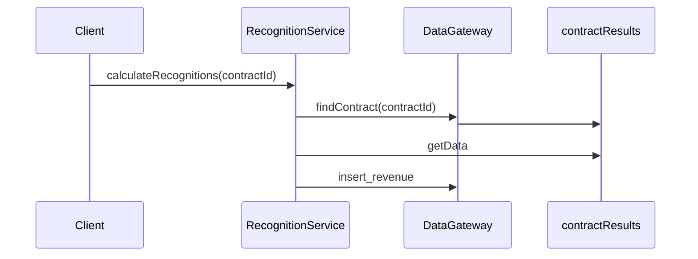
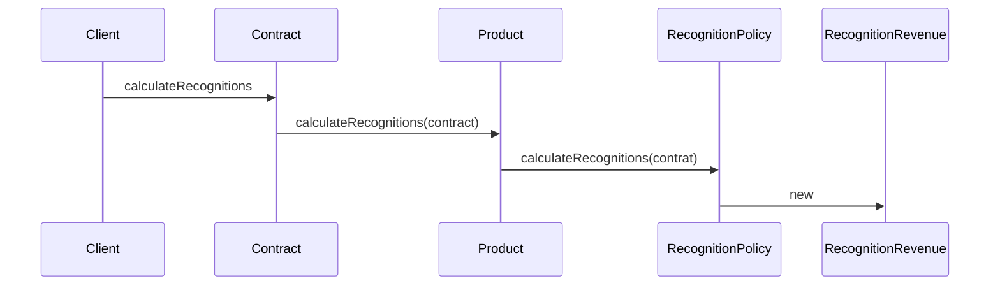
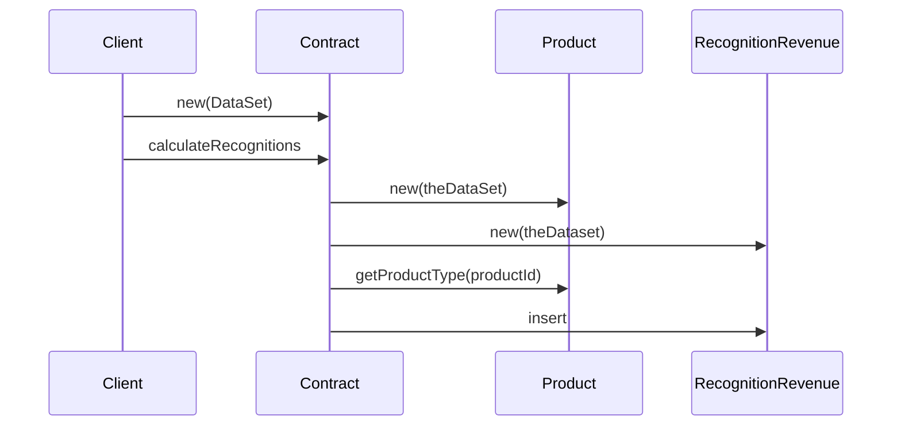

### Transaction Script
---

>Transaction Script(115)\
>비즈니스 논리를 프로시저별로 구성해 각 프로시저가 프레젠테이션의 단일 요청을 처리하게 만든다.\
>-martin folower- \
>in Patterns of Enterprise Application Architecture

>기본적으로 트랜잭션 스크립트는 프레젠테이션에서 입력을 받고, 유효성 검사와 계산을 통해 입력을 처리한 다음, 데이터베이스에 데이터를 저장하고, 다른 시스템에서 작업을 호출하는 프로시저다.\
>\
>그런 다음 필요에 따라 응답을 구성하고 서식을 지정하는 계산을 더 수행하고 추가 데이터로 프레젠테이션에 응답한다.\
>\
>기본 구성은 사용자가 수행할 각 작업마다 프로시저를 하나씩 만드는 것이다.\
>\
>즉 이 패턴은 작업 또는 비즈니스 트랜잭션마다 스크립트 하나를 만드는 패턴으로 불 수 있다.\
>모든 코드를 인라인 프로시저로 만들라는 것은 아니다.\
>\
>코드를 서브루틴으로 분리하고 이러한 서브루틴을 여러 다른 트랜잭션 스크립트에서 공유할 수 있다.\
>그래도 여전히 핵심 개념은 각 작업마다 프로시저 하나를 사용한다는 것이다.\
>-martin folower- \
>in Patterns of Enterprise Application Architecture

여기까지가 poeaa에서 martin folower가 말한 트랜잭션 스크립트다.

### 트랜잭션 스크립트 주요 특징
---

주요특징을 보면.

1. 도메인 모델 부재: 트랜잭션 스크립트는 풍부한 도메인 모델을 사용하지 않는다.
2. 절차적 로직: 각 트랜잭션은 하나의 프로시저(또는 스크립트)로 구현된다.
3. 직접적인 데이터 접근: 데이터베이스나 다른 데이터 소스에 직접 접근하여 작업을 수행한다.
4. 비즈니스 로직 집중: 모든 비즈니스 로직이 트랜잭션 스크립트 내에 집중된다.
5. 단순성: 복잡한 객체 관계나 상속 구조 없이 간단한 구조를 유지한다.

### 소매시스템에서는?
---

체크아웃, 장바구니에 상품 추가, 배송 상태 표시 등에 대한 각각의 트랜잭션 스크립트가 있을 수 있다.

### 장 단점
---

| 장점 | 단점 |
|------|------|
| 1. 대부분의 개발자가 이해할 수 있는 간단한 절차적 모델 | 1. 도메인 논리가 늘어나면서 복잡도가 상승한다 |
| 2. 행 데이터 게이트웨이, 테이블 데이터 게이트웨이를 적용해 데이터 원본 계층과 함께 사용하기에 적합하다 | 2. 트랜잭션이 비슷한 작업을 수행해야 하므로 코드가 많이 중복된다 |
| 3. 트랜잭션의 경계를 설정하기가 쉽다:    - 트랜잭션 열기와 함께 시작하고 트랜잭션 닫기와 함께 종료한다    - 툴을 사용해 배후에서 이러한 작업을 하기도 쉽다 | 3. 공통 서브루틴을 뽑아내서 이러한 문제를 어느 정도 해결할 수 있지만, 중복을 제거하기 어렵고 찾아내기는 더 어렵다 |
|  | 4. 명확한 구조가 없는 루틴 뭉치가 된다 |

>[!Note]
>행 데이터 게이트웨이 (Row Data Gateway)
>데이터베이스 테이블의 한 행을 객체로 표현.\
>각 인스턴스가 데이터베이스의 한 레코드에 해당.\
>CRUD (Create, Read, Update, Delete) 작업을 캡슐화함.(α)
>
>테이블 데이터 게이트웨이 (Table Data Gateway)
>데이터베이스의 한 테이블에 대한 모든 접근을 처리.\
>보통 정적 메서드로 구현되며, 테이블의 모든 행에 대한 작업을 수행.\
>여러 레코드에 대한 쿼리와 업데이트를 한 곳에서 관리.(α)

### 패러다임의 전환
---

트랜잭션 스크립트가 갖는 문제를 해결하기 위한 객체지향적 방법이 도메인 모델이다.

도메인 모델을 활용하지 않는 트랜잭션 스크립트

도메인 모델을 활용하는 트랜잭션 스크립트.

>[!important]
>포인트는 상품의 종류에 다라 계약의 수익을 인식하는 알고리즘이 다르다는 것이다.\
>계산 메서드는 특정 계약의 상품이 어떤 종류인지 확인하고, 올바른 알고리즘을 적용한다음, 계산의 결과를 보관할 수익 인식 객체를 생성한다.\
>수익 인식을 계산하는 알고리즘이 늘어나면 인식 전략 객체를 새로 추가하는 식으로 알고리즘을 추가할 수 있다.\
>비용은 사용의 복잡성과 데이터 원본 계층의 복잡성이다.

마지막으로

도메인 모듈도 존재 한다.

도메인 모듈은 인스턴스가 단 하나이다.

도메인 모듈의 클라이언트는 먼저 데이터베이스의 쿼리를 수행해 레코드 집합을 얻고 이 레코드 집합을 인수로 전달해 계약 객체를 만든다.

테이블 모듈은 여러 면에서 트랜잭션 스크립트와 도메인 모델의 중간적인 성격을 많이 띤다.

프로시저로만 작업하기 보단 테이블을 기준으로 도메인 논리를 구성하기 때문에 구조를 만들고 중복을 찾아 제거하기가 수월하다.

상속, 객체지향 패턴과 같이 도메인 모델에서 논리 세부 구조를 만드는 데 사용하는 여러 기법은 사용할 수 없다.

